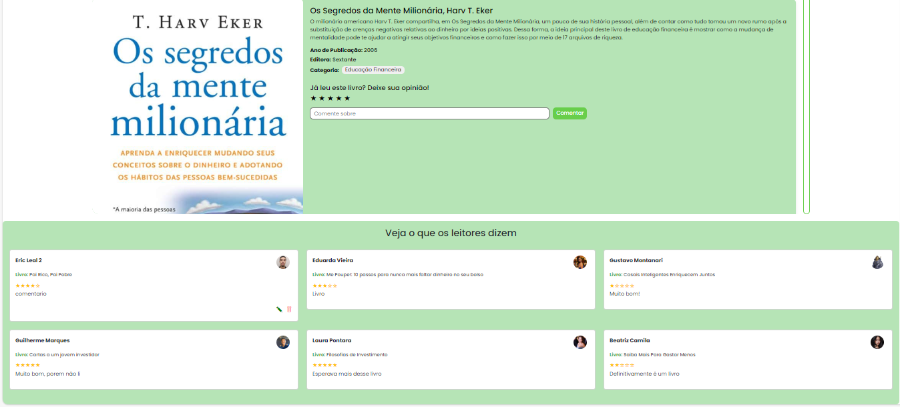

# Introdução

Informações básicas do projeto.

* **Projeto:** [MONEO]
* **Repositório GitHub:** [REPOSITÓRIO](https://github.com/ICEI-PUC-Minas-PPLES-TI/plf-es-2024-2-ti1-0385100-gestao-de-educacao-financeira.git)
* **Membros da equipe:**

  * [Beatriz Camila](https://github.com/beacmartins); 
  * [Eduarda Vieira](https://github.com/eduardavieira-dev);
  * [Eric Leal](https://github.com/Eric-Leal);
  * [Guilherme Rodrigues](https://github.com/marquezzinn);
  * [Gustavo Montanari](https://github.com/Duelixta);
  * [Laura Pontara](https://github.com/LauraPontara).

A documentação do projeto é estruturada da seguinte forma:

1. Introdução
2. Contexto
3. Product Discovery
4. Product Design
5. Metodologia
6. Solução
7. Referências Bibliográficas

✅ [Documentação de Design Thinking (MIRO)](files/processo-dt.pdf)

# Contexto

## Problema

A falta de gestão e educação financeira é um dos maiores obstáculos para as pessoas atingirem sua independência financeira. Sem o conhecimento necessário, é fácil se endividar, não conseguir poupar e tomar decisões equivocadas. A educação financeira, por sua vez, capacita as pessoas a controlarem seus gastos, planejarem o futuro, investirem de forma inteligente e alcançar seus objetivos, visto que, ao aprender a gerenciar seu dinheiro, você adquire as ferramentas para tomar decisões mais conscientes, construir um patrimônio e viver com mais tranquilidade, livre das preocupações monetárias.

## Objetivos

O objetivo geral deste projeto é desenvolver um software intuitivo que auxilie os usuários a lidarem com a falta de gestão e educação financeira, proporcionando ferramentas que os ajudem a controlar seus gastos, adquirir conhecimento sobre investimentos e boas práticas de finanças.

### Objetivos específicos:

- Auxiliar na organização de despesas pessoais, permitindo ao usuário planejar e monitorar seu orçamento de forma prática e eficiente;
- Informar sobre boas práticas de investimentos, oferecendo dicas e orientações que ajudem o usuário a tomar decisões financeiras mais conscientes e estratégicas;
- Fornecer uma calculadora financeira a fim de auxiliar o usuário a calcular montantes;
- Informar sobre opções de consórcio;
- Mostrar notícias relevantes do mercado financeiro;
- Fornecer informações sobre possíveis vagas de emprego para usuários que tenham interesse.

## Justificativa

A escolha do tema “Falta de gestão e educação financeira” para o desenvolvimento do projeto de software foi motivada pela crescente necessidade de abordar a inadimplência e a falta de conhecimento financeiro entre os brasileiros. De acordo com dados da Serasa, o Brasil registrou um aumento de 136 mil consumidores inadimplentes em julho de 2024, totalizando 72,66 milhões de pessoas em situação de inadimplência. Além disso, uma pesquisa da Agência Brasil revela que apenas 31% dos brasileiros buscam frequentemente dicas de especialistas sobre gestão financeira, e 49% nunca participam de cursos ou seminários sobre o tema. Esses dados evidenciam a urgência de ferramentas que promovam a educação financeira e auxiliem na gestão de finanças pessoais.

Os objetivos específicos foram escolhidos em razão de que, com essas funções, o software se tornará uma ferramenta eficaz e eficiente para o foco do projeto, que é auxiliar na organização e educação monetária dos usuários, visando desenvolver uma aplicação que não apenas informe, mas também eduque os usuários sobre práticas financeiras saudáveis, contribuindo para a redução da inadimplência e melhorando a qualidade de vida financeira dos clientes.

## Público-Alvo

O público-alvo do MONEO é composto por pessoas na faixa etária de 20 a 50 anos, focando especialmente em assalariados que buscam uma melhor organização financeira. Este grupo inclui jovens profissionais, trabalhadores em meio de carreira e até aqueles que se aproximam da aposentadoria, todos enfrentando desafios relacionados ao gerenciamento de suas finanças pessoais. A plataforma atende a necessidades como controle de gastos, planejamento de orçamento e auxílio na realização de metas financeiras, proporcionando uma experiência intuitiva e prática para usuários que desejam ter mais controle sobre suas finanças.

# Product Discovery

## Etapa de Entendimento

### Matriz CSD e Mapa de stakeholders


### Entrevistas qualitativas
#### Entrevista 1


#### Entrevista 2


#### Entrevista 3 


#### Entrevista 4 


#### Entrevista 5 


#### Entrevista 6 


#### Entrevista 7 


#### Entrevista 8


#### Entrevista 9 


#### Entrevista 10  


#### Entrevista 11


#### Entrevista 12


### Highlights de pesquisa


## Etapa de Definição

### Personas


# Product Design

Nesse momento, vamos transformar os insights e validações obtidos em soluções tangíveis e utilizáveis. Essa fase envolve a definição de uma proposta de valor, detalhando a prioridade de cada ideia e a consequente criação de wireframes, mockups e protótipos de alta fidelidade, que detalham a interface e a experiência do usuário.

## Histórias de Usuários

Com base na análise das personas foram identificadas as seguintes histórias de usuários:

| EU COMO...            | QUERO/PRECISO ...                          | PARA ...                               |
| --------------------- | ------------------------------------------ | -------------------------------------- |
| Estudante universitária | Organizar minhas finanças | Para alcançar minha independência financeira |  
| CLT Analista Financeira    | Auxilio para investir | Para conseguir um retorno com o investimento e dar uma vida melhor para a familia |
| Pai de familia  | Organizar minhas finanças | Para evitar gastos imprevistos e me aposentar |
| Trabalhador | Aprender sobre investimentos | Para ampliar minhas opções de renda |
| Mãe e estudante | informações sobre como financiar um imovel | Para conquistar minha casa propria |
| Jovem adulta | Controlar meus gastos | Para conseguir mora sozinha |

## Proposta de Valor

### Proposta para Persona Rachel 


### Proposta para Persona Melissa 


### Proposta para Persona Rodrigo 


## Requisitos

As tabelas que se seguem apresentam os requisitos funcionais e não funcionais que detalham o escopo do projeto.

### Requisitos Funcionais
| ID     | Descrição do Requisito                                   | Prioridade |
| ------ | ---------------------------------------------------------- | ---------- |
| RF-001 | Permitir que os usuários criem contas com informações como nome, e-mail e senha. | ALTA       |
| RF-002 | Permitir que os usuários atualizem suas informações pessoais e preferências. | MÉDIA     |
| RF-003 |  Opção para recuperar senha por meio de e-mail. | MÉDIA     |
| RF-004 | Permitir que os usuários adicionem receitas e despesas com detalhes como valor, data, categoria e descrição. | MÉDIA     |
| RF-005 | Permitir que os usuários estabeleçam e acompanhem metas financeiras (como poupança ou redução de dívida). | MÉDIA     |
| RF-006 | Gerar relatórios mensais, trimestrais ou anuais das receitas, despesas e saldo. | ALTA     |
| RF-007 | Fornecer insights sobre padrões de gastos, como principais categorias de despesas e mudanças ao longo do tempo. |  ALTA     |
| RF-008 | Notificar os usuários quando estiverem próximos de atingir o limite do orçamento. | ALTA     |
| RF-009 | Opção para configurar lembretes para registrar transações recorrentes. | MÉDIA     |   
| RF-010 | Atualizações sobre o progresso das metas financeiras definidas. | ALTA     |
| RF-011 | Opção para exportar transações e relatórios em formato CSV ou PDF. | MÉDIA     | 
| RF-012 | Seção de perguntas frequentes e tutoriais para ajudar os usuários a utilizar a plataforma. | MÉDIA     | 
| RF-013 |  Canal de comunicação para suporte ao cliente, como chat ao vivo ou formulário de contato. | ALTA     |
| RF-014 |  Ferramentas como calculadoras de juros compostos, empréstimos e investimentos. | ALTA     |


   
### Requisitos não Funcionais

| ID      | Descrição do Requisito                                                              | Prioridade |
| ------- | ------------------------------------------------------------------------------------- | ---------- |
| RNF-001 | Implementação de criptografia para proteger dados sensíveis dos usuários. | ALTA     |
| RNF-002 | Controle de acesso baseado em funções para recursos do site. | MÉDIA     |
| RNF-003 | Exibir uma política de privacidade clara sobre como os dados dos usuários serão usados e protegidos. | ALTA     | 
| RNF-004 | Conectar-se a APIs de bancos para importar transações automaticamente. | ALTA     | 
| RNF-005 | Suporte para múltiplas moedas e taxas de câmbio. | ALTA     | 
| RNF-006 | Suporte para diferentes idiomas. | MÉDIA     | 


## Projeto de Interface

Artefatos relacionados com a interface e a interacão do usuário na proposta de solução.

### Wireframes

Estes são os protótipos de telas do sistema.

##### Landing Page Moneo 

Essa é uma landing page para que o usuário posssa navegar pelas funcionalidades do sistema após fazer o login/cadastro. Nessa tela ficam as informações centrais do site. Também há alguns exemplos de telas que haverão no sistema.

[FIGMA](https://www.figma.com/design/P0nk2tg3DiBRviK0LgYxeA/Moneo?node-id=0-1&node-type=canvas&t=wHThGEPkpkdZTwOI-0)


### User Flow

**✳️DIAGRAMA DE FLUXO DE TELAS ✳️**


### Protótipo Interativo

✅ [Protótipo Interativo (Figma)](https://www.figma.com/design/hECitfhANxNDXAvHaSZPwe/Userflow-Moneo?node-id=0-1&t=uZQqr633qPvcDpns-1)  


# Metodologia

Detalhes sobre a organização do grupo e o ferramental empregado.

## Ferramentas

Relação de ferramentas empregadas pelo grupo durante o projeto.

| Ambiente                    | Plataforma | Link de acesso                                     |
| --------------------------- | ---------- | -------------------------------------------------- |
| Processo de Design Thinking | Miro       | https://miro.com/app/board/uXjVKnBExFk=/        |
| Repositório de código       | GitHub     | https://github.com/ICEI-PUC-Minas-PPLES-TI/plf-es-2024-2-ti1-0385100-gestao-de-educacao-financeira      |
| Protótipo Interativo        | Figma | https://www.figma.com/design/hECitfhANxNDXAvHaSZPwe/Userflow-Moneo?node-id=0-1&t=X5GwkispIv95iB1S-1    |


## Gerenciamento do Projeto

Divisão de papéis no grupo e apresentação da estrutura da ferramenta de controle de tarefas (Kanban).


## Vídeo do Projeto
O vídeo a seguir traz uma apresentação do problema que a equipe está tratando e a proposta de solução.


[](https://youtu.be/SrCpzZvMA94?si=pHlVyfc_oscZ-djs)


Link do vídeo no Youtube: https://youtu.be/SrCpzZvMA94?si=pHlVyfc_oscZ-djs


## Funcionalidades

#### Funcionalidade 1 - Tela de perfil
Permite a edição do nome do perfil, email, telefone e endereço, alem de permitir a troca de senha.
* **Estrutura de dados:** [Usuarios](#ti_ed_contatos)
* **Instruções de acesso:**
  * Abra o site e efetue o login
  * Clique na sua foto de perfil no canto superior direito
  * Em seguida, escolha a opção Configurações
* **Tela da funcionalidade**:


## Estruturas de Dados
Descrição das estruturas de dados utilizadas na solução com exemplos no formato JSON.Info
##### Estrutura de Dados - Usuarios
Contatos da aplicação
```json
    {
      "id": 5,
      "login": "eric",
      "email": "eric2@.com2",
      "nome": "Eric Leal",
      "senha": "123",
      "telefone": "12341123",
      "endereco": "endereço",
      "foto": "https://avatars.githubusercontent.com/u/181984841?v=4"
    }
  
```
#### Funcionalidade 2 - Comentarios da tela da biblioteca
Permite a inclusão de comentários e notas para os livros, permite edição e exclusão do comentário pelo usário que comentou. 
* **Estrutura de dados:** [Comentarios]
* **Instruções de acesso:**
  * Abra o site e efetue o login
  * Clicar no card de biblioteca
  * Em seguida, escolha o livro que deseja fazer uma avaliação
  * Comente algo sobre o livro
* **Tela da funcionalidade**:


## Estruturas de Dados
Descrição das estruturas de dados utilizadas na solução com exemplos no formato JSON.Info
##### Estrutura de Dados - Comentarios
Registro dos comentarios feito pelos usuarios
```json
  {
      "id": 1,
      "idusuario": 5,
      "livroId": 1,
      "nomeusuario": "Eric Leal 2",
      "nomeLivro": "Pai Rico, Pai Pobre",
      "comentario": "comentario",
      "nota": "4",
      "fotousuario": "https://avatars.githubusercontent.com/u/181984841?v=4"
    }
```
#### Funcionalidade 3 - Cadastro de Livros
Permite o cadastro, edição e exclusão de livros.
* **Estrutura de dados:** [livros](#ti_ed_contatos)
* **Instruções de acesso:**
  * Abra o site e efetue o login
  * Acesse a página de cadastro de livros clicando sobre o card "Cadastro de Livros" 
  * Preencha os campos com as informações e clique no botão cadastrar
  * Escolha um dos livros já cadastrados apresentados na tabela e clique sobre a livro com as informações do livro escolhido
  * Realize as devidas alterações nos dados do livro nos campos de informações e clique no botão Alterar
  * Para excluir um livro cadastrado, clique na linha da tabela e em seguida clique no botão excluir
* **Tela da funcionalidade**:


### Estrutura de Dados - Cadastro de livros
Registra um novo livro no sistema
```json
"livros": [
    {
      "titulo": "Pai Rico, Pai Pobre",
      "autor": "Robert Kiyosaki",
      "editora": "Alta Books",
      "ano": 2017,
      "categoria": "Educação Financeira",
      "sinopse": "Kiyosaki usa usa própria vivência na narrativa, que busca desenvolver uma mentalidade empreendedora nas pessoas.  O milionário americano é filho de um funcionário público que, apesar de ser inteligente e honesto, nunca havia conseguido atingir a independência financeira. Ele é o pai pobre.  Em contrapartida, o pai rico é representado pelo melhor amigo do escritor, um comerciante que conseguiu construir grande riqueza devido à forma como lidava com dinheiro e que ensinou a ele tudo sobre finanças.",
      "capa": "https://www.mobills.com.br/blog/wp-content/uploads/2021/01/livro-pai-rico-pai-pobre-robert-kiyosaki-1-768x1073.jpg",
      "compra": "https://www.mobills.com.br/blog/amazon-pai-rico-pai-pobre",
      "id": 1
    }
]
```
#### Funcionalidade 4 - Filtro de livros

* **Estrutura de dados:** [livros](#ti_ed_contatos)
* **Instruções de acesso:**
  * Abra o site e efetue o login
  * Acesse a página da biblioteca clicando sobre o card "Indicações de livros"
  * Para filtrar os livros em uma categoria específica, escolha uma das categoria na seçao de filtros e clique sobre o botão
  * A filtragem também pode ser realizada clicando sobre o botão que indica a categoria dos livros em cada card
  * Escolha um dos livros e clique no botão "Comprar" na parte inferior da imagem da capa para ser redirecionado para a plataforma de compra do livro
* **Tela da funcionalidade**:


#### Funcionalidade 5 - Tela de planilha de gestão financeira + notificações de valor limite
Permite a entrada de dados necessários para a criação da planilha através de um formulário sucinto. Ao ser criada a planilha, o usuário poderá entrar com informações sobre seus gastos mensais e visualizar um resumo financeiro, como o total gasto e saldo restante, por exemplo. A sub-funcionalidade de notificações permite que o usuário seja notficado quando o total gasto se aproximar do valor limite definido no formulário. As notificações também ficam guardadas no ícone de notificação.  

* **Estrutura de dados:** [dados-planilha]
* **Instruções de acesso:**
  * Abra o site e preencha o formulário corretamente
  * Clique no botão "Enviar"
  * A planilha será criada
  * Preencha as células da planilha como desejado
* **Tela da funcionalidade**:
  


```json
  {
    "dados-planilha": [
     {
      "dataPagamento": "2025-05-05",
      "salario": 1000000,
      "dataInicio": "2006-03-01",
      "id": "1"
     }
   ]
  }
```

#### Funcionalidade 6 - Calculadora de investimentos com histórico
Permite a inclusão, leitura, alteração e exclusão de contatos para o sistema
* **Estrutura de dados:** [Investimentos](#ti_ed_contatos)
* **Estrutura de dados:** [Histórico](#ti_ed_contatos)
* **Instruções de acesso:**
  * Abra a tela da calculadora
  * No select escolha escolha um dos invetimentos cadastrados no sistema como Tesouro direto, CDB, etc
  * Preencha os campos e calcule um investimento para ser gerado no histórico um registro
* **Tela da funcionalidade**:
  


## Estruturas de Dados
Descrição das estruturas de dados utilizadas na solução com exemplos no formato JSON.Info
##### Estrutura de Dados - Investimento
Busca de informações dos investimentos no sistema
```json
    {
        "id": 1,
        "nome": "CDB",
        "taxa": 10
    }
```

##### Estrutura de Dados - Hitórico
Registro do historico de investimentos calculados pelo usuario
```json
  {
        "id": 1,
        "nomeRegistro": "Registro 1",
        "nomeInvestimento": "Tesouro Direto",
        "valorInvestido": "1200",
        "valorTotal": "1268.25"
  }
```


#### Funcionalidade 7 - Cadastro de cursos
Permite a inclusão, leitura, alteração e exclusão de contatos para o sistema
* **Estrutura de dados:** [Cursos](#ti_ed_contatos)
* **Instruções de acesso:**
  * Abra a tela de cursos
  * Clique no link para cadastrar o curso logo ao final da tela
  * Preencha os campos e cadastre um novo curso
* **Tela da funcionalidade**:
  


#### Estrutura de Dados - Cursos
Cadastra no sistema as informações sobre o curso
```json
    {
      "id": 1,
      "nome_curso": "Introdução à Economia",
      "imagem": "https://i.ytimg.com/vi/rodzaND5E9k/maxresdefault.jpg",
      "duracao": 20,
      "link": "https://youtu.be/mDOmLJFXKlk?si=b7jUitL05l9bn0do",
      "plataforma": "YouTube"
    }
```


#### Funcionalidade 8 - Cadastro de Noticias
Permite a inclusão, leitura, alteração e exclusão de contatos para o sistema
* **Estrutura de dados:** [noticias](#ti_ed_contatos)
* **Instruções de acesso:**
  * Abra a tela de noticias sobre finanças
  * Clique no link para cadastrar a noticia logo ao final da tela
  * Preencha os campos e cadastre uma nova noticia
* **Tela da funcionalidade**:
  


#### Estrutura de Dados - noticias
Cadastra no sistema as informações sobre a noticia
```json
    {
      "titulo": "O que é Bitcoin?",
      "descricao": "Saiba mais sobre a criptomoeda mais famosa do mundo",
      "imagem": "imagens/bitcoin.jpg",
      "autor": "Gustavo H. Montanari",
      "data": "2024-10-01",
      "categoria": "criptomoedas",
      "id": "aa68"
    }
```


## Módulos e APIs
Esta seção apresenta os módulos e APIs utilizados na solução

**Images**:
* Storyset - [https://storyset.com/](https://storyset.com/) 

**Fonts:**
* Google Fonts - [https://fonts.google.com/](https://fonts.google.com/)

**Scripts:**
* Bootstrap 4 - [http://getbootstrap.com/](http://getbootstrap.com/)


# Referências
As referências utilizadas no trabalho foram:

1. **ENDIVIDAMENTO das famílias fica estável em junho**. Agência Brasil. Disponível em: [https://agenciabrasil.ebc.com.br/economia/noticia/2024-07/endividamento-das-familias-fica-estavel-em-junho-diz-cnc](https://agenciabrasil.ebc.com.br/economia/noticia/2024-07/endividamento-das-familias-fica-estavel-em-junho-diz-cnc). Acesso em: 21 set. 2024.

2. **MAPA de inadimplência e renegociação de dívidas no Brasil da Serasa**. Serasa. Disponível em: [https://www.serasa.com.br/limpa-nome-online/blog/mapa-da-inadimplencia-e-renogociacao-de-dividas-no-brasil](https://www.serasa.com.br/limpa-nome-online/blog/mapa-da-inadimplencia-e-renogociacao-de-dividas-no-brasil). Acesso em: 20 set. 2024.

3. **PESQUISA revela que 58% dos brasileiros não se dedicam às próprias finanças**. Agência Brasil. Disponível em: [https://agenciabrasil.ebc.com.br/economia/noticia/2018-03/pesquisa-revela-que-58-dos-brasileiros-nao-se-dedicam-proprias-financas](https://agenciabrasil.ebc.com.br/economia/noticia/2018-03/pesquisa-revela-que-58-dos-brasileiros-nao-se-dedicam-proprias-financas). Acesso em: 20 set. 2024.
